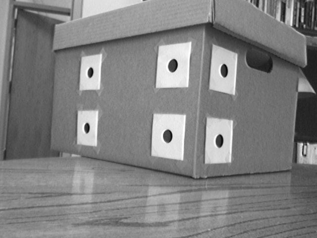

# Camera Pose Estimation using least squares method

Given instrinsic parameters and 3D points in a coordinate frame (defined at the corner of the box),
find the pose of the camera in that coordinate frame.

Here is the image.

## Execution steps

```
mkdir build
cd build
cmake ..
make
./main
```



