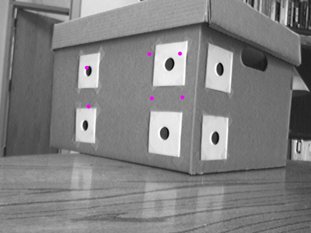
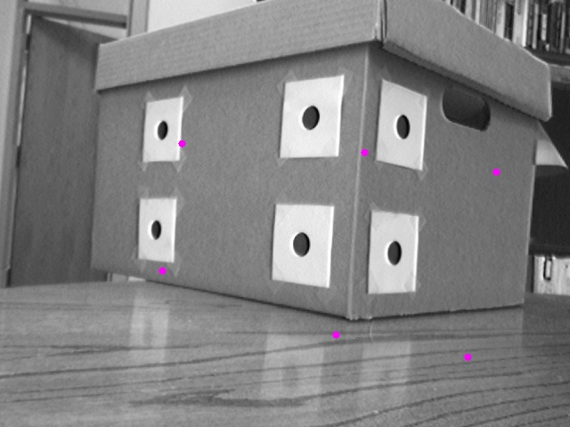
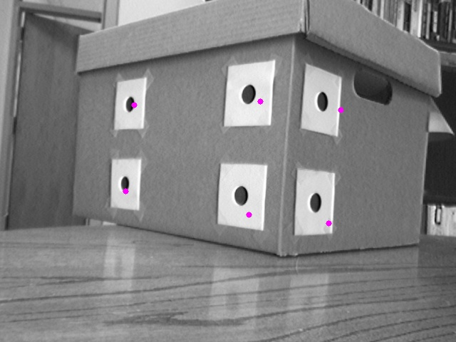
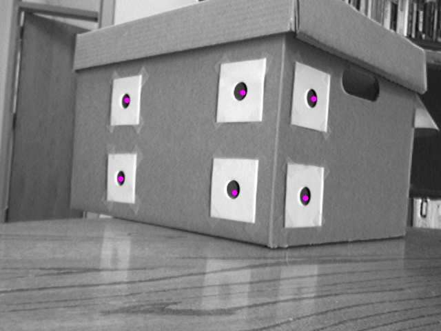
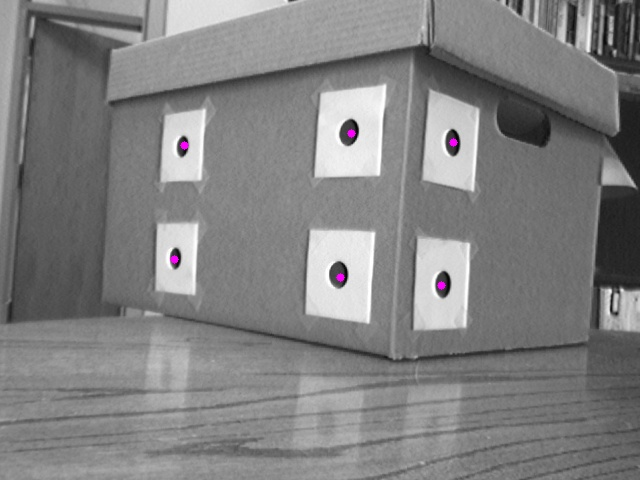

# Camera Pose Estimation using least squares method

Given instrinsic parameters and 3D points in a (world) coordinate frame (defined at the corner of the box),
find the pose of the camera in that coordinate frame.

The solution described here is using Gauss-Newton method to iteratively find the roll, pitch, yaw, x, y, z of 
the world frame from camera frame. 

## Execution steps

```
mkdir build
cd build
cmake ..
make
./main
```


### Pose estimation after step 1

### Pose estimation after step 2

### Pose estimation after step 3

### Pose estimation after step 4

### Pose estimation after step 5

